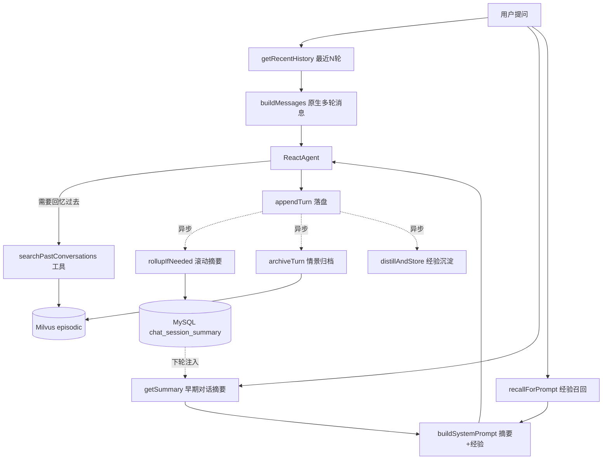

# 更新日志 - 情景记忆与滚动摘要

> 日期：2026-07-08  
> 功能：短期记忆改原生多轮 messages + 早期对话滚动摘要（summary buffer）+ 历史会话向量归档与跨会话检索（情景记忆）

---

## 一、为什么要做这个功能？

### 1.1 问题背景

对照主流 Agent 记忆体系（工作记忆 / 情景记忆 / 语义记忆 / 程序性记忆），改动前项目存在两个明显短板：

| 短板 | 说明 |
|------|------|
| 短期记忆实现原始 | 历史对话被拼成纯文本塞进 system prompt，角色边界模糊、token 效率低；窗口固定 6 对硬截断，更早的内容直接丢失 |
| 情景记忆只存不用 | `chat_message` 全量落 MySQL，但滑出 6 轮窗口后**永远无法被访问**，Agent 答不上"上次那个告警怎么处理的" |

举例：用户在第 3 轮对话里说明了故障背景，聊到第 10 轮时窗口已滑出，Agent 完全忘记背景；换一个会话问"之前 pay-service 的 OOM 最后怎么解决的"，Agent 更是一无所知——尽管这些数据都完整躺在 MySQL 里。

### 1.2 解决方案：三层短期记忆结构 + 情景记忆激活

```
system prompt
   ├─ 基础指令 + 工具指引
   ├─ 召回的历史经验（已有能力）
   └─ 早期对话滚动摘要        ← 新增：滑出窗口的内容压缩保留
messages（原生多轮）
   ├─ 最近 N 轮 user/assistant 原文   ← 改造：不再拼进 system prompt
   └─ 当前用户问题
Agent 工具
   └─ searchPastConversations        ← 新增：跨会话检索历史问答
```

对话结束后异步执行三件事（互不阻塞、失败不影响主流程）：

```
appendTurn 落盘 MySQL
   ↓ 异步
1. distillAndStore   → 经验沉淀（已有）
2. rollupIfNeeded    → 滑出窗口的旧消息由 LLM 合并进滚动摘要
3. archiveTurn       → 本轮问答向量化归档进 Milvus episodic 集合
```

---

## 二、架构变化

### 2.1 改动前

```
ChatController
   ↓
getRecentHistory（最近 6 对）
   ↓
buildSystemPrompt(history, experienceBlock)   ← 历史拼成文本进 system prompt
   ↓
agent.call(question)                           ← Agent 每轮只收到当前问题
   ↓
（超出 6 对的历史：存在 MySQL，但永远不可见）
```

### 2.2 改动后

```
ChatController
   ↓
getRecentHistory（最近 6 对） + getSummary（早期对话摘要）
   ↓
buildSystemPrompt(summary, experienceBlock)    ← system prompt 只放摘要，不放历史原文
buildMessages(history, question)               ← 历史转原生 UserMessage/AssistantMessage
   ↓
agent.call(messages) / agent.stream(messages)  ← 原生多轮消息
   ↓
异步：rollupIfNeeded（滚动摘要） + archiveTurn（情景归档） + distillAndStore（经验沉淀）
   ↓
下次任意会话提问 → Agent 可调 searchPastConversations 跨会话回忆
```

### 2.3 存储变化

| 存储 | 内容 | 新增/已有 |
|------|------|-----------|
| MySQL `chat_message` | 会话历史消息 | 已有 |
| MySQL `chat_session_summary` | 会话滚动摘要 + 已覆盖的最大 seq | **新增** |
| Milvus `episodic` 集合 | 逐轮问答向量归档（带时间戳、sessionId） | **新增** |
| Milvus `experience` / `biz` 集合 | 经验 / 文档知识库 | 已有 |

### 2.4 流程图



---

## 三、滚动摘要机制（summary buffer）

短期记忆采用主流的「最近 N 轮原文 + 更早内容压缩摘要」结构：

1. 每轮对话结束后异步检查：`maxSeq - windowSize*2` 是否超过摘要已覆盖的 `last_seq`；
2. 若有新滑出窗口的消息，取出这批消息，与旧摘要一起交给 LLM（`qwen-turbo`）合并为一份新摘要（默认不超过 800 字）；
3. 新摘要写回 `chat_session_summary`（`ON DUPLICATE KEY UPDATE`），`last_seq` 前移，保证**不重复摘要、无遗漏**；
4. 下次请求时摘要注入 system prompt，窗口内消息以原生 messages 传递，两者按 seq 精确衔接、无重叠。

摘要提示词要求保留：故障现象、涉及服务/指标/告警名、根因结论、处理动作与结果、时间点、用户目标与未决问题；去除寒暄与重复内容。

LLM 摘要失败时本轮跳过（记 warn 日志），未覆盖的消息留待下一轮继续滚动，不会丢失。

---

## 四、情景记忆机制

### 4.1 归档

每轮问答结束后异步调用 `EpisodicMemoryService.archiveTurn()`：

- 向量化文本 = `问题 + 回复（截断至 2000 字符）`；
- `content` 存可读正文：`[时间] / [会话] / [用户问题] / [助手回复]`（受 8192 字符上限约束，超长截断回复）；
- `metadata` 存 `_type=episodic / session_id / create_time`；
- 写入 Milvus `episodic` 集合（启动时由 `MilvusClientFactory` 自动创建，schema 与其他集合统一为 id/vector/content/metadata）。

### 4.2 检索（Agent 工具）

新增工具 `searchPastConversations`，system prompt 中已加指引：**用户提及"之前/上次/以前"处理过的问题时使用**。

- L2 距离转余弦相似度（`cos ≈ 1 - dist/2`），低于 `min-score`（默认 0.5）过滤；
- 返回 Top-K（默认 3）条历史问答记录，含时间戳与相似度分数，JSON 格式；
- 跨会话检索：不限定当前 sessionId，正是为了支持"换个会话也能回忆"。

### 4.3 与经验沉淀的分工

| 维度 | 情景记忆（episodic） | 经验沉淀（experience） |
|------|----------------------|------------------------|
| 记什么 | 原始问答事件（谁、何时、问了什么、答了什么） | 提炼后的因果与诊断逻辑 |
| 写入条件 | 每轮都归档 | 分级触发，低质量丢弃 |
| 召回方式 | Agent 按需调工具 | 提问前自动注入提示词 |
| 类比 | "上次发生了什么" | "这类问题该怎么解决" |

---

## 五、文件改动详解

### 5.1 新增文件

| 文件 | 职责 |
|------|------|
| `service/ConversationSummaryService.java` | 滚动摘要：读取 / 增量合并 / 清空（getSummary / rollupIfNeeded / clear） |
| `service/EpisodicMemoryService.java` | 情景记忆：归档 / 检索（archiveTurn / search） |
| `agent/tool/EpisodicMemoryTools.java` | Agent 工具 `searchPastConversations` |

### 5.2 修改文件

| 文件 | 改动 |
|------|------|
| `service/ChatService.java` | `buildSystemPrompt` 签名改为 `(summary, experienceBlock)`，不再拼历史文本；新增 `buildMessages()` 构建原生多轮消息；新增 `executeChat(agent, messages)` 重载；工具数组注册 `EpisodicMemoryTools`；system prompt 增加历史会话检索工具指引 |
| `service/ChatMemoryService.java` | 新增 `getMaxSeq()`、`getMessagesBetween()`，支撑增量摘要 |
| `controller/ChatController.java` | `/chat` 与 `/chat_stream` 改走 `agent.call(messages)` / `agent.stream(messages)`；注入摘要；异步任务扩展为「经验沉淀 + 滚动摘要 + 情景归档」；`/chat/clear` 连摘要一起清空 |
| `constant/MilvusConstants.java` | 新增 `EPISODIC_COLLECTION_NAME = "episodic"` |
| `client/MilvusClientFactory.java` | 启动时自动创建 `episodic` 集合 + 向量索引 |
| `resources/schema.sql` | 新增 `chat_session_summary` 建表 |
| `application.yml` / `application-example.yml` | 新增 `memory.summary.*`、`memory.episodic.*` 配置 |

### 5.3 核心类说明

#### ConversationSummaryService

```java
// 读取会话当前滚动摘要（无摘要返回 null）
String getSummary(String sessionId);

// 滚动摘要：有新滑出窗口的消息时，与旧摘要合并为新摘要（异步调用）
void rollupIfNeeded(String sessionId);

// 清空会话摘要（随 /api/chat/clear 调用）
void clear(String sessionId);
```

#### EpisodicMemoryService

```java
// 归档一轮问答到 Milvus episodic 集合（异步调用）
void archiveTurn(String sessionId, String question, String answer);

// 语义检索历史问答，相似度过滤后返回 Top-K
List<EpisodicRecord> search(String query);
```

#### ChatService（关键变化）

```java
// 历史不再进 system prompt，只注入摘要与经验
String buildSystemPrompt(String conversationSummary, String experienceBlock);

// 窗口内历史 + 当前问题 → 原生多轮消息
List<Message> buildMessages(List<Map<String, String>> history, String question);

// 原生多轮消息执行对话
String executeChat(ReactAgent agent, List<Message> messages);
```

---

## 六、数据库与集合结构

### chat_session_summary（会话滚动摘要，MySQL）

| 字段 | 类型 | 说明 |
|------|------|------|
| session_id | VARCHAR(64) PK | 会话 ID |
| summary | TEXT | 当前滚动摘要正文 |
| last_seq | INT | 已被摘要覆盖的最大消息 seq |
| update_time | DATETIME | 最后更新时间（自动维护） |

### episodic（情景记忆，Milvus）

| 字段 | 类型 | 说明 |
|------|------|------|
| id | VarChar PK | UUID |
| vector | FloatVector(1024) | 问答文本向量 |
| content | VarChar(8192) | `[时间]/[会话]/[用户问题]/[助手回复]` 可读正文 |
| metadata | JSON | `_type / session_id / create_time` |

---

## 七、配置说明

```yaml
memory:
  window-size: 6            # 原文窗口（对数），窗口外内容进摘要
  summary:
    enabled: true           # 滚动摘要开关
    model: qwen-turbo       # 摘要使用的模型
    max-chars: 800          # 摘要目标长度上限（字）
  episodic:
    enabled: true           # 情景记忆开关
    top-k: 3                # 检索返回条数
    min-score: 0.5          # 余弦相似度阈值
```

两项功能均可独立关闭：关闭 `summary` 退化为纯窗口截断；关闭 `episodic` 则工具返回无结果。

---

## 八、行为约定与取舍

| 场景 | 行为 | 原因 |
|------|------|------|
| `/api/chat/clear` | 清消息 + 清摘要，**不删情景归档** | 情景记忆定位为长期记忆，"上次怎么处理的"正需要跨会话留存 |
| 归档粒度 | 逐轮问答而非整段会话摘要 | 检索更精准；代价是每轮多 1 次异步 embedding |
| 摘要/归档失败 | 记 warn 日志跳过，下轮补偿 | 记忆增强不应影响主对话可用性 |
| AIOps 流程 | 未接入（无会话概念） | 与改动前保持一致 |

---

## 九、验证方法

### 9.1 原生多轮消息

1. 发起多轮对话，观察日志出现 `执行 ReactAgent.call(messages) - 原生多轮消息，共 N 条`；
2. 第二轮提问引用第一轮内容（如"我刚才问了什么"），确认 Agent 能正确回答。

### 9.2 滚动摘要

1. 同一 sessionId 连续对话超过 6 对（如 8 对）；
2. 观察日志出现 `会话摘要已滚动更新 - session=..., 覆盖至 seq=...`；
3. 查 MySQL：`SELECT * FROM chat_session_summary WHERE session_id = '...'`，确认 `summary` 内容与 `last_seq`；
4. 继续提问第 1~2 轮提到的背景信息，确认 Agent 仍"记得"（来自摘要）。

### 9.3 情景记忆归档与检索

1. 完成一轮排障对话，观察日志 `情景记忆已归档 - session=..., id=...`；
2. **开一个新会话**，提问"上次 XX 问题是怎么处理的"；
3. 确认 Agent 调用了 `searchPastConversations` 工具，且回答引用了历史处理过程；
4. 可在 Milvus 中确认 `episodic` 集合记录数增长。

### 9.4 清空会话

```bash
curl -X POST http://localhost:9900/api/chat/clear \
  -H "Content-Type: application/json" \
  -d '{"Id": "your-session-id"}'
```

确认 `chat_message` 与 `chat_session_summary` 中该会话记录均被删除。

---

## 十、费用与性能说明

| 维度 | 说明 |
|------|------|
| 额外 LLM 调用 | 仅当有消息滑出窗口时异步 1 次摘要（`qwen-turbo`），不阻塞响应 |
| 额外 Embedding | 每轮对话异步 1 次情景归档向量化 |
| 额外 Milvus 查询 | 仅当 Agent 主动调 `searchPastConversations` 时发生 |
| token 收益 | 历史走原生 messages，角色边界清晰；窗口外内容压缩为摘要，长对话下 system prompt 不再线性膨胀 |
| 存储增长 | `episodic` 集合随对话量线性增长，后续可按 `create_time` 做 TTL 清理（本次未实现） |

---

## 十一、总结

| 维度 | 说明 |
|------|------|
| 做了什么 | 短期记忆改原生多轮 messages + 滚动摘要；历史问答向量归档 + 跨会话检索工具 |
| 为什么 | 补齐主流记忆体系中「工作记忆工程实现」与「情景记忆可检索性」两块短板 |
| 存储方案 | MySQL `chat_session_summary`（摘要）+ Milvus `episodic`（逐轮归档） |
| 核心原则 | 记忆增强全部异步、失败降级，不影响主对话流程 |
| 改了哪些文件 | 新增 3 个类；修改 7 个现有文件 |
| 怎么配 | `application.yml` 中 `memory.summary.*` 与 `memory.episodic.*`，可独立开关 |
| 后续方向 | userId 维度语义记忆（环境/用户画像）、经验召回加 recency 因子、episodic TTL 清理 |
