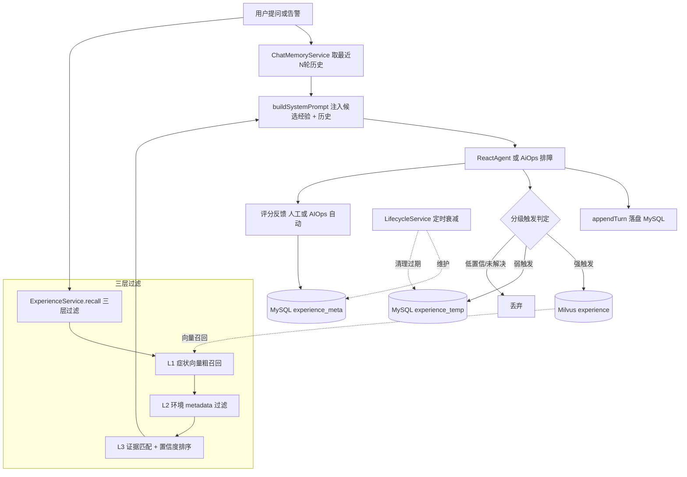

# 更新日志 - 经验沉淀

> 日期：2026-06-10  
> 功能：会话历史 MySQL 持久化 + 对话分级提炼为结构化经验 + 三层过滤召回复用 + 置信度生命周期管理

---

## 一、为什么要做这个功能？

### 1.1 问题背景

改动前，Agent 的「记忆」存在两个明显短板：

| 短板 | 说明 |
|------|------|
| 短期记忆易失 | 会话历史存在 `ChatController` 内存 `ConcurrentHashMap` 中，进程重启即丢，最多保留 6 轮 |
| 长期记忆被动 | Milvus 知识库只存上传文档，**不会**从排障对话中自动沉淀可复用经验 |

举例：上周已经完整排查过一次「order-service 内存泄漏」，本周同类告警再次出现时，Agent 仍要从零开始查日志、看指标——**上一轮排障的因果链和诊断逻辑没有被记住**。

### 1.2 解决方案：记忆持久化 + 经验沉淀闭环

```
用户提问 / 告警触发
   ↓
从 MySQL 读取最近 N 轮历史（短期记忆，重启不丢）
   ↓
三层过滤召回相关历史经验（长期记忆，语义检索）
   ↓
注入提示词 → ReactAgent / AIOps 推理排障
   ↓
对话结束后异步分级提炼 → 强触发入 Milvus / 弱触发入 MySQL 临时库
   ↓
成功复用 → 置信度上调；长期不用 → 自动衰减；过期 → 清理
```

核心原则：**经验只作参考方向，不直接执行，必须结合当前证据验证后再采纳。**

---

## 二、架构变化

### 2.1 改动前

```
ChatController
   ↓
内存 SessionInfo（ConcurrentHashMap，MAX_WINDOW_SIZE=6）
   ↓
buildSystemPrompt(history) → ReactAgent
   ↓
（对话结束，历史随进程消失）
```

### 2.2 改动后

```
ChatController / AiOpsService
   ↓
ChatMemoryService（MySQL chat_message）          ← 短期记忆持久化
ExperienceService.recall()（Milvus + MySQL）     ← 三层过滤召回
   ↓
buildSystemPrompt(history, experienceBlock) → ReactAgent / Supervisor
   ↓
异步 ExperienceService.distillAndStore()         ← 分级沉淀
   ├─ 强触发 → Milvus experience 集合 + MySQL experience_meta
   └─ 弱触发 → MySQL experience_temp（TTL）
   ↓
ExperienceLifecycleService                       ← 评分 / 衰减 / 清理
```

### 2.3 存储拆分（Milvus + MySQL 混合）

| 存储 | 内容 | 原因 |
|------|------|------|
| MySQL `chat_message` | 会话历史消息 | 关系型，按 session_id 查询方便 |
| Milvus `experience` 集合 | 经验向量 + 不可变结构化 JSON | 语义召回 |
| MySQL `experience_meta` | 置信度、使用次数、成功次数、最后使用时间 | 频繁更新，Milvus 不适合 |
| MySQL `experience_temp` | 弱触发临时经验 + `expire_at` | TTL 过期清理 |

### 2.4 流程图



---

## 三、经验结构（结构化 JSON）

LLM 提炼输出统一为如下格式，**重点存因果与诊断逻辑，而非死板操作步骤**：

```json
{
  "title": "order-service 内存泄漏导致 OOM",
  "symptoms": ["内存使用率高", "频繁 Full GC", "Pod 重启"],
  "environment": {"service": "order-service", "runtime": "Java/K8s"},
  "signals": ["jmap 堆转储", "GC 日志", "Prometheus 内存指标"],
  "root_cause": "静态 Map 缓存未设上限，随请求增长持续膨胀",
  "solution": ["为缓存添加 LRU 淘汰策略", "设置 maxEntries 上限"],
  "verification": ["内存使用率降至 70% 以下", "Full GC 频率恢复正常"],
  "risk": ["重启仅临时缓解，未修复根因会再次 OOM"],
  "confidence": 0.9,
  "reusable_scope": ["Java", "K8s"],
  "resolved": true,
  "transient": false,
  "alert_name": "HighMemoryUsage"
}
```

- 向量化文本 = `title + symptoms + root_cause`（症状导向，利于 L1 召回）
- `content` 字段存完整 JSON（上限 8192 字符）
- `metadata` 存 `environment / reusable_scope / tier / create_time`，供 L2 环境过滤

---

## 四、分级触发规则

提炼后由 LLM + 规则判定经验等级，**不是每轮对话都沉淀**：

| 等级 | 触发条件 | 存储去向 |
|------|----------|----------|
| **强触发** | 问题成功闭环（LLM 初判 + Prometheus 指标复核一致） | Milvus `experience` + MySQL `experience_meta` |
| **强触发** | 新根因模式首次出现（与已有经验相似度 < `new-pattern-threshold`） | 同上 |
| **强触发** | 人工标记「有价值」（`POST /api/experience/mark`） | 同上 |
| **弱触发** | 瞬时异常 / 误报，或 LLM 判闭环但指标复核未通过 | MySQL `experience_temp`（TTL 默认 14 天） |
| **避免沉淀** | 未解决问题、无根因、置信度 < `min-confidence` | 直接丢弃 |

闭环判定采用**两段式**：

1. LLM 从对话结论初判 `resolved` 字段
2. 调 `QueryMetricsTools` 复核：若经验关联了 `alert_name` 且当前活动告警中不再包含该告警 → 视为恢复

---

## 五、三层过滤召回

`ExperienceService.recall(query, envHint)` 分三层过滤，召回结果注入提示词时显式标注：

> 以下为历史候选经验，仅供参考，必须结合当前证据验证后再采纳，禁止直接照搬执行。

| 层级 | 方法 | 说明 |
|------|------|------|
| L1 症状匹配 | Milvus 向量粗召回 Top-N | 用症状文本向量在 `experience` 集合检索，提供排查方向 |
| L2 环境匹配 | metadata 过滤 | 按 `service / runtime / reusable_scope` 过滤不适用场景 |
| L3 证据验证 | 置信度加权排序 | `finalScore = 向量相似度 × experience_meta.confidence`，取 Top-K |

---

## 六、文件改动详解

### 6.1 新增文件

| 文件 | 职责 |
|------|------|
| `service/ChatMemoryService.java` | 会话历史 MySQL 持久化（getRecentHistory / appendTurn / clear） |
| `service/ExperienceService.java` | 经验提炼、分级沉淀、三层过滤召回 |
| `service/ExperienceLifecycleService.java` | 评分反馈、定时衰减、过期清理 |
| `controller/ExperienceController.java` | `POST /api/experience/mark`、`POST /api/experience/feedback` |
| `resources/schema.sql` | MySQL 建表脚本（chat_message / experience_meta / experience_temp） |

### 6.2 修改文件

| 文件 | 改动 |
|------|------|
| `pom.xml` | 新增 `spring-boot-starter-jdbc`、`mysql-connector-j` |
| `application.yml` | 新增 `spring.datasource`（MySQL）、`memory.*`、`experience.*` 配置 |
| `.env.example` | 新增 `MYSQL_HOST` 等 5 个占位（IP 待填写） |
| `Main.java` | 开启 `@EnableScheduling`（定时衰减任务） |
| `constant/MilvusConstants.java` | 新增 `EXPERIENCE_COLLECTION_NAME = "experience"` |
| `client/MilvusClientFactory.java` | 启动时自动创建 `experience` 集合 + 向量索引 |
| `service/VectorSearchService.java` | 新增带 `collectionName` 参数的搜索重载 |
| `service/ChatService.java` | `buildSystemPrompt` 新增注入经验块的重载 |
| `service/AiOpsService.java` | `executeAiOpsAnalysis` 支持注入经验块 |
| `controller/ChatController.java` | 移除内存 `SessionInfo`；串联召回 + 注入 + 异步沉淀 |

### 6.3 核心类说明

#### ChatMemoryService

```java
// 获取最近 windowSize 对历史（按 seq 倒序 LIMIT，再反转为正序）
List<Map<String, String>> getRecentHistory(String sessionId);

// 追加一对消息（user + assistant），seq 自增
void appendTurn(String sessionId, String question, String answer);
```

窗口大小由 `memory.window-size` 控制（默认 6 对），超出部分不删除 DB 记录，仅在读取时截断。

#### ExperienceService

```java
// 分级提炼并沉淀（异步调用，不阻塞主流程）
void distillAndStore(String sessionId, String question, String answer, boolean manualMark);

// 三层过滤召回，格式化为提示词注入块
String recallForPrompt(String query);
```

#### ExperienceLifecycleService

```java
// 评分反馈：成功 +0.05 置信度，失败 -0.10
boolean feedback(String expId, boolean success);

// 每日 03:00 执行：衰减 idle 经验 + 归档低置信 + 清理过期临时经验
@Scheduled(cron = "0 0 3 * * *")
void decayAndCleanup();
```

---

## 七、数据库表结构

### chat_message（会话历史）

| 字段 | 类型 | 说明 |
|------|------|------|
| id | BIGINT PK AUTO_INCREMENT | 自增主键 |
| session_id | VARCHAR(64) | 会话 ID |
| seq | INT | 消息序号（保证顺序） |
| role | VARCHAR(16) | `user` 或 `assistant` |
| content | MEDIUMTEXT | 消息内容 |
| create_time | DATETIME | 创建时间 |

### experience_meta（长期经验元数据）

| 字段 | 类型 | 说明 |
|------|------|------|
| exp_id | VARCHAR(64) PK | 与 Milvus 经验 ID 关联 |
| confidence | DOUBLE | 置信度（0~1，默认 0.6） |
| use_count | INT | 被召回使用次数 |
| success_count | INT | 成功复用次数 |
| tier | VARCHAR(16) | `strong` |
| last_used | DATETIME | 最后使用时间 |
| created_at | DATETIME | 创建时间 |

### experience_temp（弱触发临时经验）

| 字段 | 类型 | 说明 |
|------|------|------|
| exp_id | VARCHAR(64) | 经验 ID |
| session_id | VARCHAR(64) | 来源会话 |
| content | MEDIUMTEXT | 完整 JSON |
| symptoms | TEXT | 症状列表 |
| environment | TEXT | 环境信息 |
| confidence | DOUBLE | 置信度 |
| expire_at | DATETIME | 过期时间（默认创建后 14 天） |

---

## 八、配置说明

### 8.1 MySQL 连接（`.env`）

```bash
MYSQL_HOST=          # ← 填写虚拟机 IP
MYSQL_PORT=3306
MYSQL_DB=superbiz_agent
MYSQL_USERNAME=root
MYSQL_PASSWORD=
```

连接串已带 `createDatabaseIfNotExist=true`，账号有建库权限时会自动创建 `superbiz_agent` 库。启动时 `schema.sql` 自动建表。

### 8.2 application.yml

```yaml
memory:
  window-size: 6          # 注入提示词的历史窗口（对数）

experience:
  enabled: true           # 总开关
  recall:
    top-k: 5              # 召回候选数量
    min-score: 0.6        # L1 相似度阈值（余弦，越大越相关）
  distill:
    min-confidence: 0.6   # 低于此不沉淀
    new-pattern-threshold: 0.5  # 低于此相似度视为新根因模式
  temp:
    ttl-days: 14          # 弱触发临时经验 TTL（天）
  decay:
    cron: "0 0 3 * * *"   # 每日衰减/清理时间
    idle-days: 30         # 超过该天数未使用则衰减
    factor: 0.95          # 衰减系数
  model: qwen-turbo       # 提炼经验使用的模型
```

---

## 九、新增 API

### POST /api/experience/mark

人工标记某会话为「有价值」，强制按强触发提炼整段会话经验。

```json
{ "sessionId": "your-session-id" }
```

### POST /api/experience/feedback

经验评分反馈，成功复用上调置信度，失败下调。

```json
{ "expId": "uuid-of-experience", "success": true }
```

---

## 十、接入点

| 入口 | 召回 | 沉淀 | 评分 |
|------|------|------|------|
| `POST /api/chat` | 提问前召回经验注入提示词 | 回答后异步分级提炼 | — |
| `POST /api/chat_stream` | 同上 | 流式完成后异步提炼 | — |
| `POST /api/ai_ops` | 告警分析前召回经验注入 Planner | 报告成功后异步提炼 | 报告成功 → 对本次召回经验自动 `feedbackBatch(success=true)` |

---

## 十一、验证方法

### 11.1 记忆持久化

1. 发起多轮对话，记录 `sessionId`
2. **重启服务**
3. 调用 `GET /api/chat/session/{sessionId}`，确认 `messagePairCount` 仍正确

### 11.2 经验沉淀（强触发）

1. 模拟一次完整排障对话（告警 → 定位根因 → 给出修复方案）
2. 查看日志是否出现 `[强触发] 经验已沉淀至 Milvus`
3. 在 Milvus 中确认 `experience` 集合有新记录

### 11.3 经验召回

1. 开新会话，问与已沉淀经验相似的症状（如「内存又高了怎么办」）
2. 查看日志，确认出现「相关历史经验」注入段落
3. 提示词中应包含 `【候选经验1｜可信度X.XX】` 格式

### 11.4 评分反馈

```bash
curl -X POST http://localhost:9900/api/experience/feedback \
  -H "Content-Type: application/json" \
  -d '{"expId": "your-exp-id", "success": true}'
```

查询 MySQL `experience_meta` 表，确认 `confidence` 和 `success_count` 已更新。

### 11.5 弱触发与过期

1. 制造一次瞬时误报对话（无明确根因）
2. 确认经验进入 `experience_temp` 且 `expire_at` 约为 14 天后
3. 等待定时任务或手动将 `expire_at` 改为过去时间，确认被清理

---

## 十二、费用与性能说明

| 维度 | 说明 |
|------|------|
| 额外 LLM 调用 | 每轮对话结束后异步 1 次提炼（`qwen-turbo`），不阻塞响应 |
| 额外 Embedding | 强触发沉淀时 1 次向量化 |
| 额外 Milvus 查询 | 每轮提问前 1 次 L1 召回 |
| MySQL 依赖 | 应用启动即连库，虚拟机 MySQL 需开放远程访问 |
| 分级触发 | 显著减少无效沉淀，避免 Milvus 被低质量经验污染 |

---

## 十三、推荐闭环

```
监控告警
   ↓
症状分析（Agent 推理）
   ↓
召回历史经验（三层过滤，仅供参考）
   ↓
验证当前特征是否匹配
   ↓
生成排障路径 → 执行修复
   ↓
验证结果（LLM + Prometheus 指标复核）
   ↓
经验评分（成功上调 / 失败下调）
   ↓
分级沉淀（强 → Milvus / 弱 → 临时库 / 低置信丢弃）
```

---

## 十四、总结

| 维度 | 说明 |
|------|------|
| 做了什么 | 会话历史 MySQL 持久化 + 对话分级提炼结构化经验 + 三层过滤召回 + 置信度生命周期 |
| 为什么 | 让 Agent「越用越懂」，同类问题不必从零排障 |
| 存储方案 | Milvus（向量+不可变经验）+ MySQL（可变元数据+临时经验+会话历史） |
| 核心原则 | 经验只作参考，必须验证；不直接执行 |
| 改了哪些文件 | 新增 4 个类 + 1 个 SQL；修改 10 个现有文件 |
| 怎么配 | `.env` 填 `MYSQL_HOST`；`application.yml` 中 `memory.*` 和 `experience.*` |
| 新增 API | `POST /api/experience/mark`、`POST /api/experience/feedback` |
