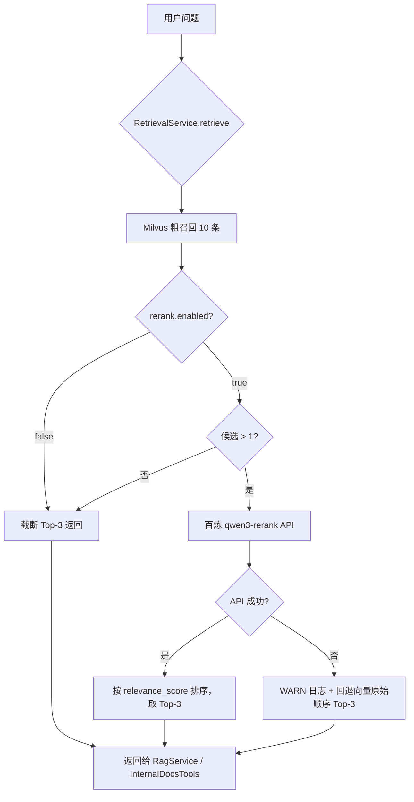

# 更新日志 - 文档重排

> 日期：2026-05-31  
> 功能：在 Milvus 向量召回后，使用阿里云百炼 `qwen3-rerank` 模型对候选文档进行语义重排

---

## 一、为什么要做这个功能？

### 1.1 问题背景

RAG（检索增强生成）的典型流程是：**用户提问 → 向量检索 → 把文档塞进 Prompt → LLM 回答**。

向量检索（Embedding + 余弦/L2 距离）擅长**快速粗筛**，但有两个局限：

| 局限 | 说明 |
|------|------|
| 语义理解浅 | 向量模型把文本压成固定维度向量，可能丢失细粒度语义 |
| Top-K 太小 | 原来 `top-k=3`，Milvus 直接返回 3 条，没有「二次精选」机会 |

举例：用户问「磁盘满了怎么处理」，向量检索可能返回 3 条都提到「磁盘」，但最相关的「清理步骤」文档排在第 5 位——因为向量距离略大，**根本没进入 Top-3**。

### 1.2 解决方案：两阶段检索

```
用户问题
   ↓
Milvus 粗召回（recall-top-k=10）  ← 多取一些候选，保证「不漏」
   ↓
百炼 qwen3-rerank 精排           ← 按 query 与文档的语义相关性重新排序
   ↓
取 Top-K=3 送入 LLM              ← 只把最相关的 3 条给大模型
```

这是工业界 RAG 的标准做法，叫做 **Recall + Rerank**。

---

## 二、架构变化

### 2.1 改动前

```
RagService / InternalDocsTools
        ↓
VectorSearchService.searchSimilarDocuments(query, topK=3)
        ↓
直接返回 3 条 → 构建 Prompt / 返回 JSON
```

### 2.2 改动后

```
RagService / InternalDocsTools
        ↓
RetrievalService.retrieve(query)          ← 新增：统一检索入口
        ↓
VectorSearchService.searchSimilarDocuments(query, recallTopK=10)  ← 粗召回
        ↓
DocumentRerankService.rerank(query, candidates, topK=3)         ← 百炼重排
        ↓
返回精排后的 3 条
```

### 2.3 流程图



---

## 三、文件改动详解

### 3.1 新增：`DocumentRerankService.java`

**职责**：封装阿里云百炼重排 HTTP API。

**为什么用 HTTP 而不是 SDK？**

项目使用的 `dashscope-sdk-java 2.17.0` **不包含** Java 版的 `TextReRank` 类（百炼官方文档目前只提供了 Python SDK 示例）。为避免升级 SDK 引入兼容风险，直接用 HTTP 调用，与现有 Embedding（SDK）和 Generation（SDK）并存。

**API 端点**（qwen3-rerank 专用）：

```
POST https://dashscope.aliyuncs.com/compatible-api/v1/reranks
Authorization: Bearer $DASHSCOPE_API_KEY
Content-Type: application/json
```

**请求体示例**：

```json
{
  "model": "qwen3-rerank",
  "query": "磁盘满了怎么处理",
  "documents": ["文档1内容...", "文档2内容...", "..."],
  "top_n": 3,
  "instruct": "Given a web search query, retrieve relevant passages that answer the query."
}
```

**响应体示例**：

```json
{
  "results": [
    { "index": 2, "relevance_score": 0.9334 },
    { "index": 0, "relevance_score": 0.7123 },
    { "index": 5, "relevance_score": 0.4521 }
  ]
}
```

- `index`：对应请求中 `documents` 数组的下标（0-based）
- `relevance_score`：语义相关分，0~1，越大越相关

**核心逻辑**：

1. 从候选 `SearchResult` 列表提取 `content` 组成 `documents` 数组
2. 调用 API，解析 `results`
3. 按 `index` 找回原始 `SearchResult`，写入 `rerankScore`
4. 按 API 返回顺序（已按分数降序）组装最终列表

**容错（不降级）**：

| 异常场景 | 处理方式 |
|----------|----------|
| HTTP 4xx/5xx | WARN 日志，返回向量原始顺序的前 topN 条 |
| 响应为空 | 同上 |
| index 越界 | 跳过该条，其余正常处理 |
| 网络超时 | 同上 |

**关键设计**：重排失败**不会抛异常中断** RAG 或 Agent 流程，而是静默回退到改动前的向量检索顺序。用户体验不受影响，只是少了精排增益。

---

### 3.2 新增：`RetrievalService.java`

**职责**：检索编排层，统一「粗召回 → 重排 → 截断」流程。

**为什么单独抽一层？**

原来 `RagService` 和 `InternalDocsTools` 各自调用 `VectorSearchService`，如果两处都加重排逻辑会重复。抽成 `RetrievalService` 后：

- 所有检索入口走同一条路，行为一致
- 以后加缓存、过滤、混合检索等，只改一处

**核心方法**：

```java
public List<SearchResult> retrieve(String query) {
    // 1. 决定召回数量：启用重排时用 recall-top-k，否则用 top-k
    int recallK = rerankEnabled ? Math.max(recallTopK, topK) : topK;

    // 2. Milvus 粗召回
    List<SearchResult> recalled = vectorSearchService.searchSimilarDocuments(query, recallK);

    // 3. 无需重排时直接截断返回
    if (!rerankEnabled || recalled.size() <= 1) {
        return truncate(recalled, topK);
    }

    // 4. 百炼重排
    List<SearchResult> reranked = documentRerankService.rerank(query, recalled, topK);

    // 5. 打印重排前后对比日志
    logger.info("{}", DocumentRerankService.formatOrderComparison(...));

    return reranked;
}
```

**调试日志示例**：

```
重排前(向量分): [1:abc123...(score=0.8234), 2:def456...(score=0.9012), 3:ghi789...(score=0.7456)]
  -> 重排后(重排分): [1:def456...(rerank=0.9334), 2:abc123...(rerank=0.7123), 3:ghi789...(rerank=0.4521)]
```

注意：Milvus L2 距离**越小越相似**，而 rerank score **越大越相关**，所以重排后顺序变化是正常现象。

---

### 3.3 修改：`VectorSearchService.java` → `SearchResult`

**改动**：增加 `rerankScore` 字段。

```java
public static class SearchResult {
    private String id;
    private String content;
    private float score;        // Milvus 向量距离分（L2，越小越相似）
    private String metadata;
    private Float rerankScore;  // 百炼重排分（0~1，越大越相关；未重排时为 null）
}
```

**为什么保留两个分？**

- `score`：向量检索原始分，便于对比重排效果
- `rerankScore`：重排后的语义相关分，Agent 工具返回 JSON 时会一并输出

`VectorSearchService` 本身**没有任何逻辑改动**，它仍然只负责 Milvus 向量检索。

---

### 3.4 修改：`RagService.java`

**改动**：注入 `RetrievalService`，替换直接调用 `VectorSearchService`。

```java
// 改动前
List<SearchResult> searchResults =
    vectorSearchService.searchSimilarDocuments(question, topK);

// 改动后
List<SearchResult> searchResults =
    retrievalService.retrieve(question);
```

RAG 的 Prompt 构建、流式生成等后续逻辑**完全不变**。

---

### 3.5 修改：`InternalDocsTools.java`

**改动**：与 RagService 相同，改为调用 `RetrievalService.retrieve(query)`。

同时移除了不再需要的 `@Value("${rag.top-k}")` 字段（topK 统一由 `RetrievalService` 管理）。

Agent 调用 `queryInternalDocs` 工具时，返回的 JSON 现在会多一个 `rerankScore` 字段（重排成功时）。

---

### 3.6 修改：`application.yml`

新增配置项：

```yaml
rag:
  top-k: 3                    # 最终送入 LLM 的文档数（不变）
  recall-top-k: 10            # Milvus 粗召回数量（新增）
  model: "qwen3-max"
  rerank:
    enabled: true             # 是否启用重排，默认 true
    model: qwen3-rerank       # 百炼重排模型
    instruct: "Given a web search query, retrieve relevant passages that answer the query."
```

| 配置项 | 默认值 | 说明 |
|--------|--------|------|
| `rag.top-k` | 3 | 重排后最终保留的文档数 |
| `rag.recall-top-k` | 10 | Milvus 粗召回数量，应 ≥ top-k |
| `rag.rerank.enabled` | true | 设为 false 则完全回退到改动前行为 |
| `rag.rerank.model` | qwen3-rerank | 百炼重排模型名 |
| `rag.rerank.instruct` | 问答检索提示 | 指导模型按「能否回答问题」排序 |

**关闭重排**（等效于改动前）：

```yaml
rag:
  rerank:
    enabled: false
```

---

## 四、未改动的部分

| 组件 | 原因 |
|------|------|
| `pom.xml` | 不升级 SDK，重排走 HTTP |
| `VectorSearchService` 检索逻辑 | 职责分离，粗召回保持原样 |
| `ChatController` / 前端 | 接口契约不变 |
| Milvus 索引 / Embedding | 入库流程不受影响 |

---

## 五、如何验证重排生效

### 5.1 看日志

启动应用后发起一次 RAG 查询或 Agent 对话（触发 `queryInternalDocs`），在日志中搜索：

```
检索服务初始化: topK=3, recallTopK=10, rerankEnabled=true
开始检索, query=..., recallK=10, finalTopK=3, rerank=true
百炼重排完成, 返回 3 条文档
重排前(向量分): [...] -> 重排后(重排分): [...]
```

如果重排前后顺序不同，说明功能正常工作。

### 5.2 看 Agent 工具返回

`queryInternalDocs` 返回的 JSON 中，每条文档会包含：

```json
{
  "id": "xxx",
  "content": "...",
  "score": 0.8234,
  "metadata": "...",
  "rerankScore": 0.9334
}
```

`rerankScore` 非 null 表示重排成功。

### 5.3 验证降级

临时设置错误的 API Key 或 `rerank.enabled: false`，确认：

- 错误 Key：日志出现 WARN「回退为向量检索原始顺序」，RAG 仍正常回答
- `enabled: false`：日志中 `rerank=false`，行为与改动前一致

---

## 六、费用与性能说明

- **额外 API 调用**：每次检索多 1 次百炼 Rerank API 请求
- **延迟增加**：粗召回 10 条 + 重排，大约增加 200~500ms（取决于文档长度和网络）
- **Token 消耗**：Rerank API 按 `query + documents` 总 Token 计费，10 条 × 800 字符/doc 量级通常可接受
- **API Key**：复用现有 `DASHSCOPE_API_KEY`，无需额外配置

---

## 七、总结

| 维度 | 说明 |
|------|------|
| 做了什么 | Milvus 召回 10 条 → 百炼 qwen3-rerank 精排 → 取 Top 3 |
| 为什么 | 提升 RAG 检索精度，把最相关的文档排在前面 |
| 怎么不降级 | 重排失败自动回退向量顺序；`enabled=false` 完全等同改动前 |
| 改了哪些文件 | 新增 2 个 Service，修改 4 个现有文件 |
| 怎么调 | `application.yml` 中 `rag.rerank.*` 配置项 |
